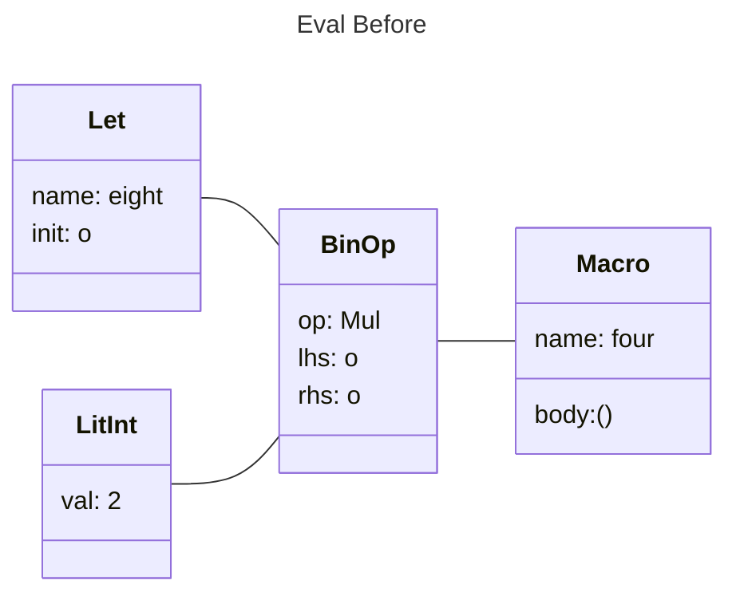
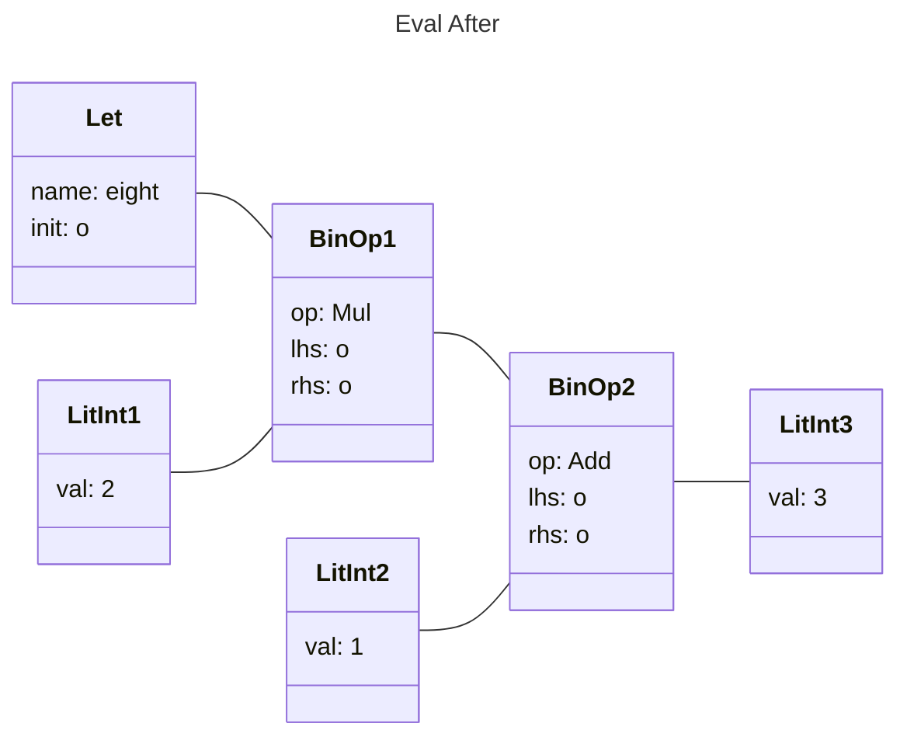

# Syntax Extension

## Source Analysis

### Tokenization

Rust컴파일러의 첫 번쨰 단계는 토큰화이다. raw text의 sequence를 token단위로 변환 시키는 구간이다.
이 때 Rust는 4가지의 Type으로 토큰을 분리한다

1. 식별자 : foo, name, jys, self, ... 와 같은 변수명, 함수명 등
2. 리터럴 : 42, 0x16, 72u32, 0______0, "const", ... 와 같은 상수 타입
3. 키워드 : _, fn, self, match, yield, macro, await, async, ... 와 같은 예약어
4. 기호 : [], :, ::, ?, ~, @, ... 배열, 스코프, Path, 메서드 호출 등의 기호

```c
#define SUB int
#define BEGIN {
#define END }

SUB main() BEGIN
    printf("Hello, World!\n");
END
```
C에서는 define을 통해 매크로를 계층적으로 표현할 수 있다.

### Parsing

TokenStream이 AST로 변환되며, 실제 메모리에서 프로그램의 구문구조를 구축하는 작업이 포함된다.

### Token Tree(tt)

토큰 트리는 토큰과 AST사이에 있다. 토큰은 Tree의 Root가 될 수도 Leaf가 될 수도 Branch가 될 수도 있다. ( 일반적으로 대부분 Leaf )
그러나 그룹화 토큰 (...), [...], {...}의 경우는 절대 Leaf Token이 될 수 없다.

## AST Macro

구문확장은 $name! $arg만 보고 어떠한 종류의 확장인지 파악할 수 있다.
1. derive 확장
2. proc-macro 확장
3. 선언적 확장

Macro의 구문확장은 AST로 구문 분석되기 때문에 statement, expression, pattern, type, item에 대해 선언할 수 있다.

식별자, struct field, match arms에는 사용할 수 없다

## 확장(Expansion)

위에서 설명했다 싶이 AST는 Macro구문을 컴파일 시점에 Node로 취급한다.

가령 `let eight = 2 * four!();`은 아래와 같이 평가된다.

### Before



### After



`let eight = 2 * (1 + 3);`과 같이 매크로가 컴파일 시점에 평가된다.

## Hygiene

Macro는 주변 컨텍스트를 방해하지 않고 어디에서나 호출할 수 있어야 한다.
```rust
make_local!();
assert_eq!(local, 0);
```
특정 지역변수를 선언하다거나,

```rust
let mut local = 0;
use_local!();
```
특정 지역변수를 사용하는등의 매크로 외부 컨텍스트에 대해 개입하면 안된다.

# 선언적 매크로

선언적 매크로는 `macro_rules!`를 통해 할 수 있으며, 단순하게 규칙과 확장을 선언하는 것으로서 매크로를 작성할 수 있다.

`($matcher) => ($expansion)`으로 Rule을 선언할 수 있다.

## 메타변수

Matcher에는 Variable Capture도 사용할 수 있다.

`($e:expr)`과 같이 $뒤에 식별자 :뒤에 타입을 지정해 주면된다.

- block : 중괄호로 둘러싸인 명령문 / 표현식의 블록
- expr : 모든 표현식
- ident : 식별자 ( 키워드 포함 )
- item : 함수, 구조체, 모듈, impl 등
- lifetime : 라이프타임
- literal : 리터럴
- meta : 메타아이템 #[...], #![...]
- pat : 패턴
- stmt : 진술
- tt : 단일 토큰 트리
- ty : 유형
- vis : 가시성 한정자 pub, pub(crate)

## 반복

`$(...) sep rep`
- (...) : 반복되는 Matcher
- sep : 구분자
- rep : 필수 반복 연산자 ? : 1회, * : 0회 이상, + : 1회 이상


